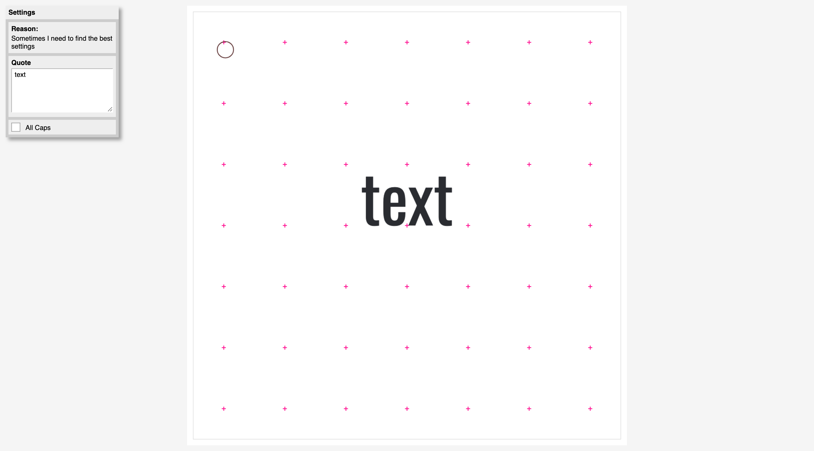

# cc-sketch

Creative coding library

<span style="display:block;text-align:center"></span>

## How?

I started with a 30-day-challenge and created the base for this library. You can see the [code](https://github.com/MatthijsKamstra/creative-coding) I have written and see the [examples](https://matthijskamstra.github.io/creative-coding/)


Creative code library and examples create with [Haxe](http://www.haxe.org) (I'm currently only focussing on the JavaScript target but with Haxe that could easily change). Do you want to know more about this beautiful programming language: [README_HAXE.MD](README_HAXE.MD)!



I created a simple [example](https://matthijskamstra.github.io/cc-sketch/) in this repo, but if you need more [examples](https://matthijskamstra.github.io/creative-coding/).


## Haxelib

How to install cc-sketch

Use this git repos as a development directory:

```
haxelib dev cc-sketch path/to/folder
```

or use this git-repository directly

```
haxelib git cc-sketch https://github.com/MatthijsKamstra/cc-sketch.git
```

don't forget to add it to your build file

```
-lib cc-sketch
```
